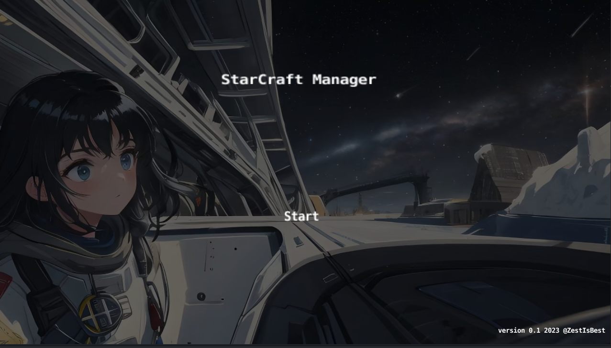

#  StarCraft Manager Version 0.x

2023 developed by @ZestIsBest

---

    StarCraft Manager is a multi platform (mostly moblie) Business simulation Game/AVG developed using defold.
    In this game, you, as the manager of a newly established professional eSports team, need to manage the team from scratch, train players and even buy and sell players, arrange match planning and matchmaking rows to earn more money and enter higher leagues, with the ultimate goal of winning the top league championship. In the process, this game also provides a rich and interesting world background and storyline.

## Game Background(背景介绍)

## Game Guide/Screenshoots(游戏指南)

Start Page:
开始界面：

## Game Mechanics(游戏机制)

## Storyline(剧情)

## Development progress/goals(开发进度/目标)

## Next Version Development Goals(下一版本开发目标)

- 一个真正可玩的游戏
- 嵌入剧情编写引擎例如Inkle或者Yarn
- 添加更多的A级联赛对阵和S级联赛内容
- 添加转会市场/队员买卖功能
- 添加更多的音效/语音
- 添加存档/读取存档的功能

---

All images used in this game are generated by AI models.